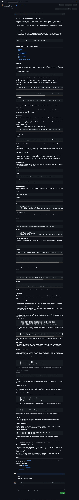

# Password Regex Masterclass

[](https://github.com/Thecaprifire)
[](https://choosealicense.com/licenses/mit/)


## Description
This tutorial provides a comprehensive guide to understanding and constructing a regular expression (regex) for matching strong passwords. Whether you’re a beginner or an experienced developer, this tutorial will break down each component of the regex pattern, explaining how it contributes to ensuring password strength.

The tutorial is hosted on a GitHub Gist, titled “A Regex of Strong Password Matching”, where you can find a detailed explanation of the following concepts:

	• Anchors: Learn how to define the beginning and end of your password strings.
	• Quantifiers: Control the repetition of characters or groups to enforce password length and complexity.
	• Grouping Constructs: Organize and capture groups of patterns within your regex.
	• Lookahead Assertions: Ensure the presence of specific elements in your password without consuming characters.
	• Bracket Expressions: Define sets of characters that your password must include.
	• Character Classes: Match various types of characters, such as digits, letters, or symbols.
	• Character Escapes: Handle special characters within your regex patterns.
	• Password Validation Conclusion: Wrap up your understanding with a comprehensive validation example.

By the end of this tutorial, you’ll have a solid understanding of how to construct and apply a regex pattern that meets the criteria for a strong password. The tutorial is structured to be accessible for learners at different levels, making it a valuable resource for anyone looking to enhance their regex skills.


## Table of Contents:
- [Overview](#overview)
- [The Challenge](#the-challenge)
- [Installation Process](#installation-process)
- [Usage Instructions](#usage-instructions)
- [Actual Gist Link](#actual-gist-link)
- [Walkthrough Video](#walkthrough-video)
- [Screenshot](#screenshot)
- [Resources](#resources)
- [Questions](#questions)
- [License](#license)


# Overview


## The Challenge
To create a tutorial that explains how a specific regular expression, or regex, functions by breaking down each part of the expression and describing what it does.

The following steps were undertaken to create an effective strong password matching regex:

	1.	Performed an in-depth analysis of best practices and recommendations for constructing secure passwords.
	2.	Determined the essential elements that must be verified in a strong password, using insights from credible sources.
	3.	Formulated a regex pattern that enforces strong password standards based on the identified elements.
	4.	Set up a GitHub Gist, adhering to the guidelines outlined in the “Installation Process” section.
	5.	In the newly established Gist, drafted a comprehensive explanation of the regex pattern for strong password verification, dissecting each component and its function in ensuring password security. This explanation was tailored for both beginner programmers and fellow developers.
	6.	Circulated the Gist link within the community to foster discussion and exploration of various methods for strong password validation using regex.


## Assigned User Story:
```
AS A web development student
I WANT a tutorial explaining a specific regex
SO THAT I can understand the search pattern the regex defines
```


## Acceptance Criteria:
```
GIVEN a regex tutorial
WHEN I open the tutorial
THEN I see a descriptive title and introductory paragraph explaining the purpose of the tutorial, a summary describing the regex featured in the tutorial, a table of contents linking to different sections that break down each component of the regex and explain what it does, and a section about the author with a link to the author’s GitHub profile
WHEN I click on the links in the table of contents
THEN I am taken to the corresponding sections of the tutorial
WHEN I read through each section of the tutorial
THEN I find a detailed explanation of what a specific component of the regex does
WHEN I reach the end of the tutorial
THEN I find a section about the author and a link to the author’s GitHub profile
```


## Installation Process:
**Set up a GitHub Gist:**

	1.	Log in to your GitHub account or register for one if you haven’t done so yet.
	2.	Go to: https://gist.github.com/ to initiate a new Gist.
	3.	In the “Gist Description” field, provide a brief overview of the challenge.
	4.	Add a new file to the Gist by clicking “Add File” and assign it an appropriate name, then add the (.md) file extension to the file name so that your Markdown renders correctly.
	5.	In your newly created Gist, draft a concise explanation of the regex, detailing each component and its role in validation process.
	6.	Describe how the regex can be adjusted to accommodate new criteria.

**Share your Gist:**

	7.	Once you have finalized the explanation and adjustments to the regex, save your Gist by selecting “Create public Gist” or “Create secret Gist” according to your preference.
	8.	Distribute the link to your Gist with others to explore different strategies and interpretations of the regex.

By completing this task, you will not only enhance your understanding of strong password regex but also gain experience in creating and sharing a GitHub Gist.

## Usage Instructions:
	1.	Open the published GitHub Gist link.
	2.	Review the introductory section and overview.
	3.	Browse the table of contents to examine the various parts of the tutorial.
	4.	Study and grasp each element of the regex pattern.
	5.	Implement the insights acquired from the tutorial in your own projects.


## Actual Gist Link:
[A Regex of Strong Password Matching](https://gist.github.com/Thecaprifire/d739a8bda9e12bfb357babad590e8052)


## Walkthrough Video:
[Click Here to Watch](https://youtu.be/gjeaj8e8NdE)


## Screenshot:



## Resources

 1. [The Ultimate Guide to Regex for Password Validation](https://formulashq.com/the-ultimate-guide-to-regex-for-password-validation/#6)
 2. [Regular expressions](https://developer.mozilla.org/en-US/docs/Web/JavaScript/Guide/Regular_expressions)
 3. [Regex to Validate Password Strength](https://stackoverflow.com/questions/5142103/regex-to-validate-password-strength)
 4. [Password Strength Checker using Regular Expressions in JavaScript](https://www.cloudzilla.ai/dev-education/password-strength-checker-javascript/)
 5. [Regex Match a Strong Password with Two or More Special Characters](https://stackoverflow.com/questions/4670639/regex-match-a-strong-password-with-two-or-more-special-characters)
 6. [How to Validate Password Strength Using Regex and JavaScript](https://dev.to/ayka_code/how-to-validate-password-strength-using-regex-and-javascript-4083)
 7. [RegEx Question for Strong Password](https://learn.microsoft.com/en-us/answers/questions/353667/regex-question-for-strong-password)
 8. [Password](https://uibakery.io/regex-library/password)

 These references offered valuable insights into the development and application of regex patterns for strong password matching, as well as guidance on teaching regex to beginners and other scholars. This information was integrated into the creation of the detailed tutorial, which aimed to provide a user-friendly yet academically thorough explanation of strong password matching using regex.


 ## Questions
  Contact the author with any questions!<br>
  Github link: [Thecaprifire](https://github.com/Thecaprifire)<br>
  Email: ianjandaluz@gmail.com


## License
  This project is [MIT](https://choosealicense.com/licenses/mit/) licensed.<br />

  Copyright © 2024 [JAN IAN DALUZ](https://github.com/Thecaprifire)
  
  <hr>
  <p align='center'><i>
  Here’s to your coding journey! 🎉 JAN IAN DALUZ
  </i></p>